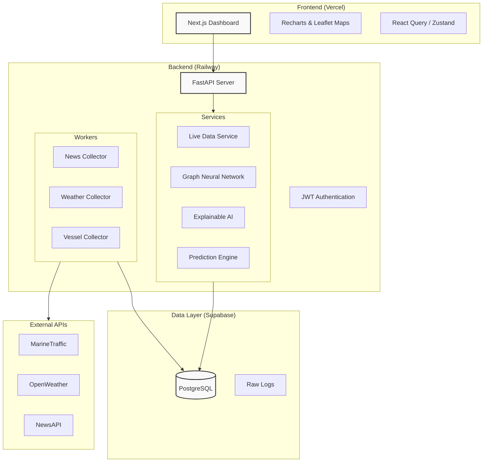

# Nexus Risk Platform 🚢 📉

> **Supply Chain Resilience Predictor**
> *AI-powered disruption prediction for global semiconductor supply chains.*

[](https://nexus-risk-platform-vedq.vercel.app)
[](https://nexus-risk-platform-production.up.railway.app/docs)
[](LICENSE)

## 📖 Overview

The **Nexus Risk Platform** is an advanced analytics dashboard designed to monitor, analyze, and predict supply chain disruptions in the critical Taiwan-to-US West Coast semiconductor corridor.

By integrating real-time vessel tracking, weather data, and geopolitical news with Graph Neural Networks (GNN) and Explainable AI (XAI), Nexus provides logistics managers with actionable insights to mitigate risks before they impact production.

### Key Features

*   **Real-time Tracking**: Live monitoring of key shipping routes and vessel positions.
*   **Risk Prediction**: AI-driven delay probabilities based on multi-factor analysis.
*   **Network Analysis**: Graph Neural Network (GNN) modeling of port cascading failures.
*   **Explainable Insights**: "Why" behind the risk—weather, congestion, or geopolitical events.
*   **Interactive Dashboard**: Beautiful, responsive UI built with Next.js and Mapbox/Leaflet.

---

## 🏗️ Architecture

The platform follows a modern microservices-inspired architecture:



## 🛠️ Tech Stack

### Frontend
-   **Framework**: Next.js 14 (App Router)
-   **Language**: TypeScript
-   **Styling**: Tailwind CSS, Framer Motion
-   **Visualization**: Recharts, Leaflet (React-Leaflet)
-   **State Management**: React Query

### Backend
-   **Framework**: FastAPI (Python 3.10+)
-   **ORM**: SQLAlchemy (Async)
-   **ML Frameworks**: PyTorch, PyTorch Geometric, Scikit-learn
-   **Data Processing**: NumPy, Pandas, NetworkX

### Infrastructure
-   **Database**: PostgreSQL (via Supabase)
-   **Hosting**: Railway (Backend), Vercel (Frontend)
-   **CI/CD**: GitHub Actions (Linting, Testing, Data Collection)

---

## 🚀 Quick Start

### Prerequisites
-   Python 3.10+
-   Node.js 18+
-   PostgreSQL / Supabase account

### 1. Clone the Repository
```bash
git clone https://github.com/veerryait/nexus-risk-platform.git
cd nexus-risk-platform
```

### 2. Backend Setup
```bash
cd backend
python -m venv venv
source venv/bin/activate  # Windows: venv\Scripts\activate
pip install -r requirements.txt

# Create .env file (see .env.example)
cp .env.example .env

# Run Server
uvicorn app.main:app --reload
```

### 3. Frontend Setup
```bash
cd frontend
npm install

# Create .env.local file
echo "NEXT_PUBLIC_API_URL=http://localhost:8000" > .env.local

# Run Dev Server
npm run dev
```

Visit `http://localhost:3000` to view the dashboard.

---

## 📚 Documentation

Detailed documentation is available in the `/docs` directory:

-   [**Technical Documentation**](docs/TECHNICAL_DOCS.md): Deep dive into data pipelines, ML models, and API endpoints.
-   [**User Guide**](docs/USER_GUIDE.md): How to interpret risk scores and use the dashboard.

## 🤝 Contributing
1.  Fork the Project
2.  Create your Feature Branch (`git checkout -b feature/AmazingFeature`)
3.  Commit your Changes (`git commit -m 'Add some AmazingFeature'`)
4.  Push to the Branch (`git push origin feature/AmazingFeature`)
5.  Open a Pull Request

## 📄 License
Distributed under the MIT License. See `LICENSE` for more information.
